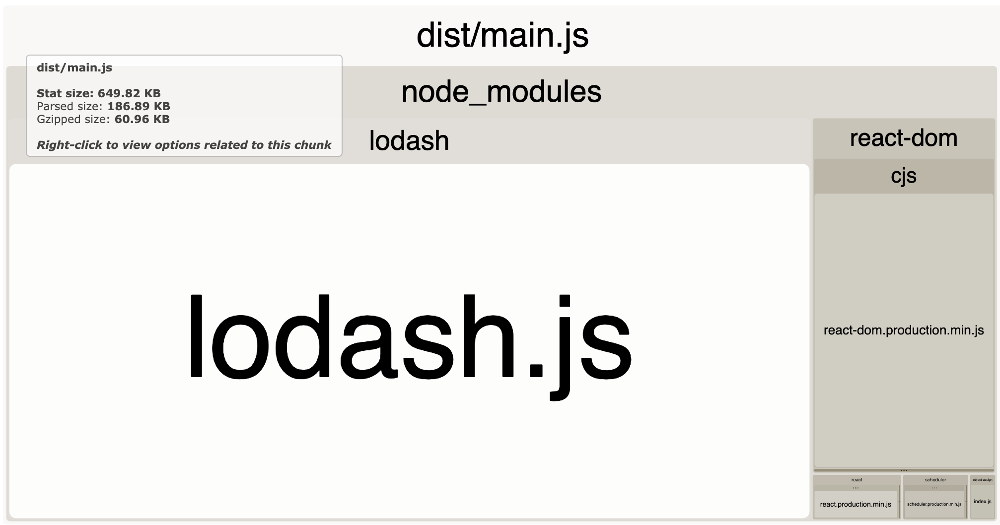
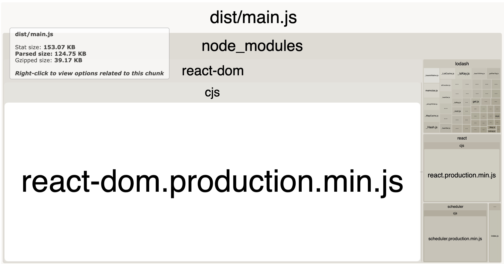
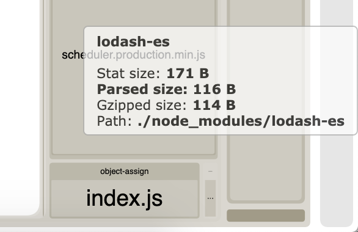
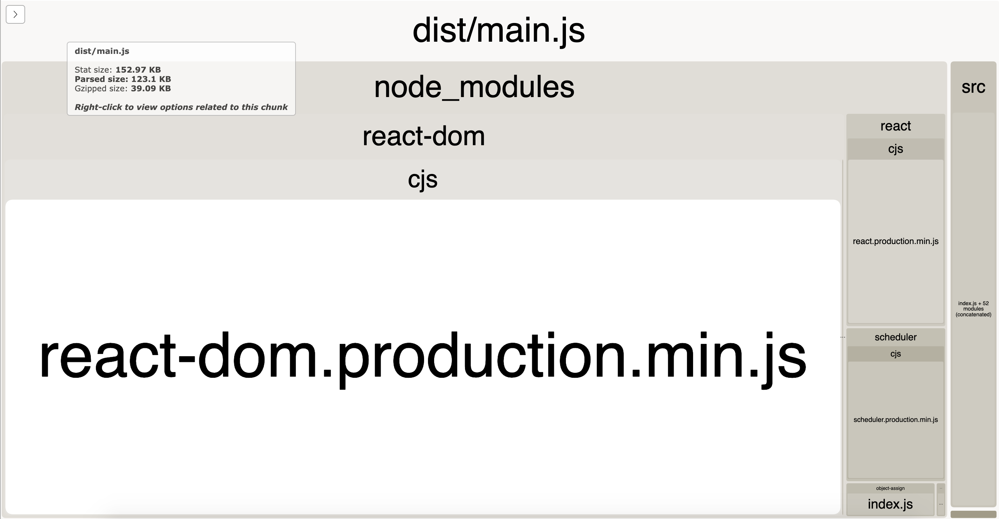

# Tree Shaking Exploration

An isolated environment to explore how tree shaking works with webpack 4. This was inspired by uncertainty and questions around implementing the best practises described here - https://developers.google.com/web/fundamentals/performance/optimizing-javascript/tree-shaking/. 

### Quickstart:
#### How to start a project:
1. Fork this project in the GitHub UI
2. Clone your forked copy ```git clone https://github.com/[YOUR-USERNAME]/tree-shaking-exploration```
3. Change into the directory ```cd tree-shaking-exploration```
4. Use node version 10.8.0 and have npm installed
5. Run ```npm install``` to add module dependencies

#### How to run the code:
1. Build the bundle in one terminal window with ```npm run build```
2. Open the server in a second terminal window with ```npm start```
3. Your default browser will open the application at localhost:8080
4. When finished with the application, close both process with ```^c```

#### Project Goals:
1. Understand how to set up a project correctly for webpack to tree shake the bundle. 
2. Know how lodash is a strange case and accomodate this to make sure the whole of lodash isn't included in the compiled code. 
3. Use bundle analyzer to look at the before and after state of a bundle
4. Add some commit tools to check that the size of the bundle does not dramatically increase in a commit. Potentially a pre commit hook if all commits go straight into master. 

#### User Stories:
```
As a developer
So that I can implement and debug tree shaking in a large project
I need an isolated project to build a test case
```

#### Investigation:
##### Iteration 1
1. Added Lodash and used `get` to access some nested properties in an object. 
2. This meant that building the project generated a bundle of main.js  at 187 KiB (using webpack)
3. Ran `npx webpack --profile --json > stats.json` to generate an analysis via [webpack-bundle-analyzer](https://www.npmjs.com/package/webpack-bundle-analyzer) and `npx webpack-bundle-analyzer ./stats.json`. Main bundle is listed as 649KB in the analyzer out put. Lodash is 527KB stat size, 68.84KB parsed, 24.12KB gzipped. 
4. Here is the initial analysis: 

##### Iteration 2
5. Changed the import of `get` to access the function from `lodash/get`
7. Building the project now produces a bundle of main.js at 125 KiB (using webpack)
8. Running bundle analyzer and main bundle is listsed as 153.07KB in the analyser output. Lodash is 30.93KB stat size, 7.14KB parsed, 2.16KB gzipped.
9. Here is the new analysis: 

##### Iteration 3
10. Installed `lodash-es` for the lodash library as ES modules.
11. Changed the import of `get` to access the function from `lodash-es/get`
12. Building the project now produces a bundle of main.js at 123 KiB (using webpack)
13. Running bundle analyzer and main bundle is listsed as 152.97KB in the analyser output. Lodash-es is insanely small: 171B stat size, 116B parsed, 114B gzipped. Here is the analyzer as proof: 
14. Here is the new analysis: 

##### Conclusions
15. Parsed size of the bundle corresponds with the output of the webpack `npm run build` step. 
16. First bundle analyzer lists lodash as 527KB. First main bundle (649KB) minus this lodash (527KB) is 122KB - essentially the main bundle using `lodash/get` and `lodash-es`. 
17. It is not 'OK' to use `import * as _ from 'lodash'`. But you do not have to use `lodash-es` to reduce the bundle. 
18. Save the browser having to process approximately 527KB of javascript in your bundle by using cherry picking from `lodash/[function_name]` or `lodash-es/[function_name]` to import only the functions you specifically need in the client side app. 

##### Questions
19. Why does the 30KB of lodash from `lodash/get` not impact the bundle size more. I.e. causing a bigger difference between iteraction 2 and 3. 